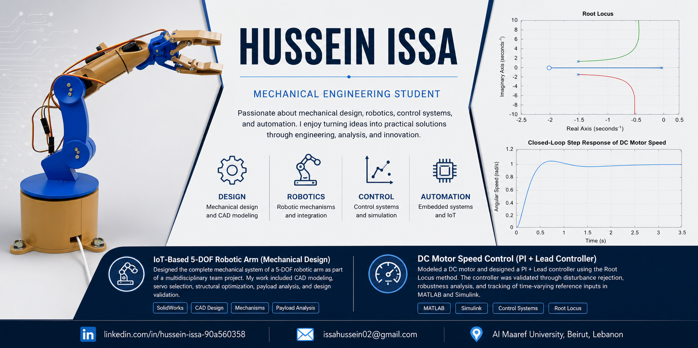

  

# Hussein Issa

**Mechanical Engineering Student | Aspiring Mechatronics Engineer**

Welcome to my engineering portfolio! This repository serves as a central hub for my engineering projects, showcasing my work in **mechanical design**, **robotics**, **control systems**, and **automation**. Each project documents the engineering process from problem definition and design to analysis, validation, and final results.

---

## About Me

I am a Mechanical Engineering student at **Al Maaref University** with a strong interest in robotics, mechatronics, automation, and control systems. I enjoy combining theoretical engineering principles with practical design to solve real-world problems and continuously expand my technical skills through hands-on projects.

My current interests include:

- Mechanical Design
- Robotics
- Mechatronics
- Control Systems
- Industrial Automation
- Embedded Systems

---

## Technical Skills

### CAD & Design
- SolidWorks
- AutoCAD
- Engineering Drawings

### Simulation & Analysis
- MATLAB
- Simulink
- Classical Control Systems

### Programming
- C++

---

# Featured Projects

## 🤖 IoT-Based 5-DOF Robotic Arm (Mechanical Design)

**Role:** Mechanical Design Engineer (Team Project)

Designed the complete mechanical system of a 5-degree-of-freedom robotic arm as part of a multidisciplinary university project. My responsibilities included CAD modeling, servo integration, mechanical optimization, center of mass analysis, payload estimation, and structural validation.

**Key Skills**
- SolidWorks
- Mechanical Design
- Servo Selection
- CAD Assembly
- Payload Analysis
- Design Optimization

**Repository**

➡️ https://github.com/husseinIssa05/robotic-arm-design

---

## ⚙️ DC Motor Speed Control Using PI + Lead Controller

Designed and validated a classical PI + Lead controller for DC motor speed regulation using MATLAB and Simulink. The project included mathematical modeling, controller design using the Root Locus method, disturbance rejection, robustness analysis, and tracking of time-varying reference inputs.

**Key Skills**
- MATLAB
- Simulink
- Classical Control
- Root Locus
- System Modeling
- Robustness Analysis

**Repository**

➡️ https://github.com/husseinIssa05/dc-motor-speed-control

---

## Currently Learning

I am continuously expanding my knowledge in:

- Industrial Automation
- Robotics
- Embedded Systems
- Mechatronics
- Advanced Control Systems

---

## Connect With Me

**LinkedIn**

https://www.linkedin.com/in/hussein-issa-90a560358

**Email**

issahussein02@gmail.com

---

> *Thank you for visiting my portfolio. I am always open to opportunities where I can apply my engineering knowledge, contribute to meaningful projects, and continue learning as an engineer.*
